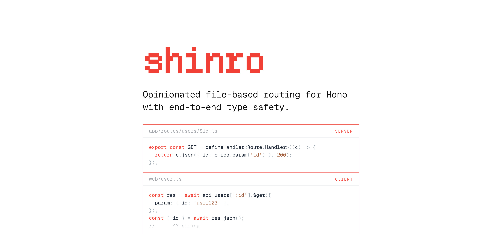

[](https://github.com/arikchakma/shinro)

<p align="center">Opinionated file-based routing for Hono with end-to-end type safety.</p>

<p align="center">
  <a href="https://github.com/arikchakma/shinro/blob/main/LICENSE">
    
  </a>
</p>

Shinro discovers route modules through one Vite plugin, mounts them onto your
own Hono instance, and generates a typed Hono client.

```ts
// app/app.ts
import { logger } from 'hono/logger';
import { defineApp } from 'shinro/app';
import { routes } from 'shinro/routes';

const app = defineApp().use('*', logger()).route('/', routes());

export default app;
```

That mount is the core of Shinro. `routes()` returns a Hono sub-router that you
attach wherever it belongs in the middleware chain. `route()` copies its schema
onto your app, leaving one Hono instance at runtime and one complete RPC
contract in `typeof app` — generated and hand-written routes included.

## Why Shinro

Shinro keeps its scope deliberately narrow. Other file-routing frameworks hand
you an application; Shinro hands you routes and leaves the application under
your control.

- **One plugin.** `shinro()` handles routing, RPC types, and development
  integration.
- **You own the server.** Start it with `serve()` or `Bun.serve()`, choose how
  it runs, and handle shutdown in your own code. Shinro stays focused on
  routing.
- **Generated code you can read.** `.shinro/routes.ts` is a real file holding
  one chained Hono registration per route, ready to inspect or debug.
- **Types without extra ceremony.** Import the generated client to get the
  response body, status, and parameters of every route — including early returns
  from directory middleware.
- **Node.js and Bun.** The same routing setup and typed client work on both
  runtimes.

## Repository guide

- [`packages/shinro`](./packages/shinro) — the package, with the
  [installation and usage guide](./packages/shinro/README.md).
- [`examples/api`](./examples/api) — a runnable Node.js API demonstrating every
  route authoring convention.
- [`docs/file-route-conventions.md`](./docs/file-route-conventions.md) — the
  complete list of filename conventions.
- [`docs/SPEC.md`](./docs/SPEC.md) — the complete v0.1 contract, diagnostics, and test
  requirements.

## Workspace commands

```sh
vp install
vp check
vp test
vp run shinro#build
```

## Acknowledgements

Shinro builds on:

- [Hono](https://hono.dev) — the HTTP framework. Shinro generates plain Hono
  registrations and leans on Hono RPC for the typed client.
- [Vite+](https://viteplus.dev) — the unified toolchain for building, type
  checking, testing, and formatting the monorepo.
- [React Router](https://reactrouter.com) — the source of the `$param`,
  `(group)`, and `[escape]` filename conventions.

## Contributing

Bug reports and pull requests are welcome.

## License

[MIT](./LICENSE) &copy; [Arik Chakma](https://x.com/imarikchakma)
